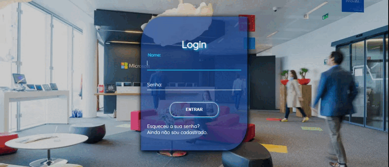

<h1 align="center"> :desktop_computer: Demonstração: </h1>

***
### :mag: Sobre  
Página de login simples, utilizando apenas *usuário* e *senha* previamente cadastrados, com links que dão as opções de *recuperação
de senha* ou de *realizar um cadastro*.  
Projeto realizado para praticar a construção de sites, treinar posicionamento através do CSS, animações e diversos outros efeitos.  
A imagem utilizada como plano de fundo da página encontra-se disponível nos arquivos junto ao código, 
mas você pode encontra-la também no site: https://www.pexels.com/pt-br/

***
### :hammer_and_wrench: Ferramentas Utilizadas  
- <code></code>
- <code></code>
